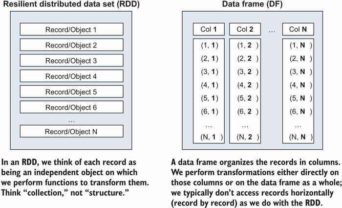
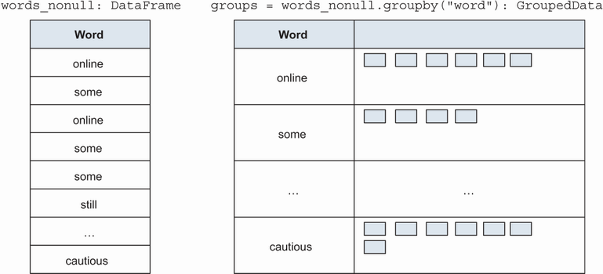

<!-- TOC -->

- [Essential of that book - index](#essential-of-that-book---index)
- [Data Analysis with Python and PySpark](#data-analysis-with-python-and-pyspark)
  - [Get the data](#get-the-data)
  - [Mistakes or omissions](#mistakes-or-omissions)
  - [Link to the book](#link-to-the-book)
  - [Link to the GitHub repo](#link-to-the-github-repo)
- [Chapter 2 - First Data Program In PySpark](#chapter-2---first-data-program-in-pyspark)
  - [Ingest and explore: Setting the stage for data transformation](#ingest-and-explore-setting-the-stage-for-data-transformation)
    - [Reading data into a data frame with spark.read](#reading-data-into-a-data-frame-with-sparkread)
    - [The DataFrameReader object](#the-dataframereader-object)
    - [Schema of DataFrame](#schema-of-dataframe)
    - [docs about function](#docs-about-function)
    - [show()](#show)
  - [Simple column transformations: Moving from a sentence to a list of words](#simple-column-transformations-moving-from-a-sentence-to-a-list-of-words)
    - [Selecting specific columns using select()](#selecting-specific-columns-using-select)
    - [Renaming columns: alias and withColumnRenamed](#renaming-columns-alias-and-withcolumnrenamed)
    - [Reshaping your data: Exploding a list into rows](#reshaping-your-data-exploding-a-list-into-rows)
  - [Filtering rows](#filtering-rows)
  - [Additional exercises](#additional-exercises)
    - [Exercise 2.2](#exercise-22)
      - [Solution](#solution)
- [Chapter 3 Submitting and scaling your first PySpark program](#chapter-3-submitting-and-scaling-your-first-pyspark-program)
  - [Ordering the results on the screen using orderBy](#ordering-the-results-on-the-screen-using-orderby)

<!-- /TOC -->

# Essential of that book - index

https://learning.oreilly.com/library/view/data-analysis-with/9781617297205/OEBPS/Text/index.htm

# Data Analysis with Python and PySpark

This is the companion repository for the _Data Analysis with Python and PySpark_
book (Manning, estimated publishing date: 2022.) It contains the source
code and data download scripts, when pertinent.

## Get the data

The complete data set for the book hovers at around ~1GB. Because of this, [I
moved the data sources to Drobpox](
https://www.dropbox.com/sh/ebwuv1y2rrwl6v8/AAAPEQ8F12RMKcmC8pjFUYiSa?dl=0) to
avoid cloning a gigantic repository. The book assumes the data is under
`./data`.

## Mistakes or omissions

If you encounter mistakes in the book manuscript (including the printed source
code), please use the Manning platform to provide feedback.

## Link to the book

- https://learning.oreilly.com/library/view/data-analysis-with/9781617297205/
  
## Link to the GitHub repo

- https://github.com/jonesberg/DataAnalysisWithPythonAndPySpark

# Chapter 2 - First Data Program In PySpark

The pyspark program provides quick and easy access to a Python REPL with PySpark preconfigured: in the last two lines of listing 2.1, we see that the variables spark and sc are preconfigured. When using my favorite code editor, I usually prefer to start with a regular python/IPython shell and add a Spark instance from said shell, like in appendix B. In the next section, we explore spark and sc as the entry points of a PySpark program by defining and instantiating them.

PySpark uses a builder pattern through the `SparkSession.builder` object. For those familiar with object-oriented programming, a builder pattern provides a set of methods to create a highly configurable object without having multiple constructors. In this chapter, we will only look at the happiest case, but the `SparkSession` builder pattern will become increasingly useful in parts 2 and 3 as we look into cluster configuration and adding dependencies to our jobs.

## Ingest and explore: Setting the stage for data transformation
 
### Reading data into a data frame with spark.read

Reading data into a data frame is done through the `DataFrameReader` object, which we can access through `spark.read`.

### The DataFrameReader object

    In [3]: spark.read
    Out[3]: <pyspark.sql.readwriter.DataFrameReader at 0x115be1b00>
    
    

    In [4]: dir(spark.read)
    Out[4]: [<some content removed>, _spark', 'csv', 'format', 'jdbc', 'json',
    'load', 'option', 'options', 'orc', 'parquet', 'schema', 'table', 'text']

PySpark can accommodate the different ways you can process data. Under the hood, 

    spark.read.csv()

will map to 

    spark.read.format('csv').load()

and you may encounter this form in the wild.

### Schema of DataFrame

When working with a larger data frame (think hundreds or even thousands of columns), you may want to see the schema displayed more clearly. PySpark provides 

    printSchema()

Since `printSchema()` directly prints to the REPL with no other option, should you want to filter the schema, you can use the `dtypes` attributes of the data frame, which gives you a list of tuples (`column_name`, `column_type`). You can also access the schema programmatically (as a data structure) using the `schema` attribute.

Let assume that our DataFrame name is: "book"

    print(book.dtypes)

Using the shell doesn’t just apply to PySpark, but using its functionality can often save a lot of searching in the documentation. I am a big fan of using:

    dir()

on an object when I don’t remember the exact method I want to apply

### docs about function

PySpark’s source code is very well documented. If you’re unsure about the proper usage of a function, class, or method, you can print the

    __doc__
 
attribute or, for those using IPython, **use a trailing question mark (or two, if you want more details)**.

    # you can use `print(spark.__doc__)` if you don't have iPython.
    In [292]: spark?

### show()

Enter the `show()` method, which displays a few rows of the data back to you—nothing more, nothing less. With `printSchema()`, this method will become one of your best friends when performing data exploration and validation. By default, it will show 20 rows and truncate long values.

**The show() method takes three optional parameters:**

- `n` can be set to any positive integer and will display that number of rows.

- `truncate`, if set to true, will truncate the columns to display only 20 characters. Set to False, it will display the whole length, or any positive integer to truncate to a specific number of characters.

- `vertical` takes a Boolean value and, when set to True, will display each record as a small table. If you need to check records in detail, this is a very useful option.

## Simple column transformations: Moving from a sentence to a list of words

In a single line of code (I don’t count the import or the show(), which is only being used to display the result), we’ve done quite a lot. The remainder of this section will introduce basic column operations and explain how we can build our tokenization step as a one-liner. More specifically, we learn about the following:

- The `select()` method and its canonical usage, which is selecting data

- The `alias()` method to rename transformed columns

- Importing column functions from `pyspark.sql.functions` and using them

Splitting our lines of text into arrays or words

    from pyspark.sql.functions import split
    
    lines = book.select(split(book.value, " ").alias("line"))
    
    lines.show(5)

### Selecting specific columns using select()

In PySpark’s world, a data frame is made out of `Column` objects, and you perform transformations on them. The most basic transformation is the identity, where you return exactly what was provided to you. If you’ve used SQL in the past, you might think that this sounds like a `SELECT` statement, and you’d be right! You also get a free pass: the method name is also conveniently named `select()`

The simplest select statement ever:

    book.select(book.value)

Selecting the value column from the book data frame

    from pyspark.sql.functions import col
    
    book.select(book.value)
    book.select(book["value"])
    book.select(col("value"))
    book.select("value")

PySpark provides a `split()` function in the `pyspark.sql.functions` module for splitting a longer string into a list of shorter strings. The most popular use case for this function is to split a sentence into words. The `split()` function takes two or three parameters:

- A column object containing strings

- A Java regular expression delimiter to split the strings against

- An optional integer about how many times we apply the delimiter (not used here)

        from pyspark.sql.functions import col, split
        
        lines = book.select(split(col("value"), " "))
        
        lines
        
        # DataFrame[split(value,  , -1): array<string>]
        
        lines.printSchema()
        
        # root
        #  |-- split(value,  , -1): array (nullable = true)
        #  |    |-- element: string (containsNull = true)
        
        lines.show(5)
        
        # +--------------------+
        # | split(value,  , -1)|
        # +--------------------+
        # |[The, Project, Gu...|
        # |                  []|
        # |[This, eBook, is,...|
        # |[almost, no, rest...|
        # |[re-use, it, unde...|
        # +--------------------+
        # only showing top 5 rows   

PySpark Documentation

https://spark.apache.org/docs/latest/api/python/

Source code for pyspark.sql.functions

https://spark.apache.org/docs/latest/api/python/_modules/pyspark/sql/functions.html#split

### Renaming columns: alias and withColumnRenamed

When performing a transformation on your columns, PySpark will give a default name to the resulting column. In our case, we were blessed by the `split(value, , -1)` name after splitting our value column, using a space as the delimiter. While accurate, it’s not programmer-friendly. This section provides a blueprint to rename columns, both newly created and existing, using `alias()` and `withColumnRenamed()`.

There is an implicit assumption that you’ll want to rename the resulting column yourself, using the `alias()` method. Its usage isn’t very complicated: when applied to a column, it takes a single parameter and returns the column it was applied to, with the new name. A simple demonstration is provided in the next listing.

    book.select(split(col("value"), " ")).printSchema()
    # root
    #  |-- split(value,  , -1): array (nullable = true)
    #  |    |-- element: string (containsNull = true)
    
    book.select(split(col("value"), " ").alias("line")).printSchema()
    
    # root
    #  |-- line: array (nullable = true)
    #  |    |-- element: string (containsNull = true)

`alias()` provides a clean and explicit way to name your columns after you’ve performed work on it. On the other hand, it’s not the only renaming player in town. Another equally valid way to do so is by using the `.withColumnRenamed()` method on the data frame.

### Reshaping your data: Exploding a list into rows

Enter the `explode()` function. When applied to a column containing a container-like data structure (such as an array), it’ll take each element and give it its own row.

    from pyspark.sql.functions import explode, col
    
    words = lines.select(explode(col("line")).alias("word"))
    
    words.show(15)

Lower the case of the words in the data frame

    from pyspark.sql.functions import lower
    words_lower = words.select(lower(col("word")).alias("word_lower"))
    
    words_lower.show()

## Filtering rows

Conceptually, we should be able to provide a test to perform on each record. If it returns true, we keep the record. False? You’re out! PySpark provides not one, but two identical methods to perform this task. You can use either `.filter()` or its alias .`where()`.

If you want to negate a whole expression in a `filter()` method, PySpark provides the `~` operator. We could theoretically use `filter(~(col("word") == ""))`.

    words_nonull = words_clean.filter(col("word") != "")
    
    words_nonull.show()

## Additional exercises

For all exercises, assume the following:

    from pyspark.sql import SparkSession
    
    spark = SparkSession.builder.getOrCreate()

### Exercise 2.2

Given the following data frame, programmatically count the number of columns that aren’t strings (answer = only one column isn’t a string).

`createDataFrame()` allows you to create a data frame from a variety of sources, such as a pandas data frame or (in this case) a list of lists.

    exo2_2_df = spark.createDataFrame(
        [["test", "more test", 10_000_000_000]], ["one", "two", "three"]
    )
    
    exo2_2_df.printSchema()
    # root
    #  |-- one: string (nullable = true)
    #  |-- two: string (nullable = true)
    #  |-- three: long (nullable = true)

#### Solution

Using a list comprehension (see appendix C), we can iterate over each dtypes of our data frame. Because `dtypes` is a list of tuple, we can destructure to x, y, where x maps to the name of the columns and y to the type. We only need to keep the ones where y != "string".

    print(len([x for x, y in exo2_2_df.dtypes if y != "string"]))  

    # => 1

# Chapter 3 Submitting and scaling your first PySpark program

The easiest way to count record occurrence is to use the `groupby()` method, passing the columns we wish to group as a parameter. The `groupby()` method in listing 3.1 returns a `GroupedData` and awaits further instructions. Once we apply the `count()` method, we get back a data frame containing the grouping column word, as well as the count column containing the number of occurrences for each word.

Counting word frequencies using `groupby()` and `count()`

    groups = words_nonull.groupby(col("word"))
    
    print(groups)
    
    # <pyspark.sql.group.GroupedData at 0x10ed23da0>
    
    results = words_nonull.groupby(col("word")).count()
    
    print(results)
    
    # DataFrame[word: string, count: bigint]
    
    results.show()
    
    # +-------------+-----+
    # |         word|count|
    # +-------------+-----+
    # |       online|    4|
    # |         some|  203|
    # |        still|   72|
    # |          few|   72|
    # |         hope|  122|
    # [...]
    # |       doubts|    2|
    # |    destitute|    1|
    # |    solemnity|    5|
    # |gratification|    1|
    # |    connected|   14|
    # +-------------+-----+
    # only showing top 20 rows

Starting with the word_nonull seen in this section, which of the following expressions would return the number of words per letter count (e.g., there are X one-letter words, Y two-letter words, etc.)?

Assume that pyspark.sql.functions.col, pyspark.sql.functions.length are imported.

    from pyspark.sql.functions import col, length
    
    words_nonull.select(length(col("word")).alias("length")).groupby(
        "length"
    ).count().show(5)
    
    # +------+-----+
    # |length|count|
    # +------+-----+
    # |    12|  815|
    # |     1| 3750|
    # |    13|  399|
    # |     6| 9121|
    # |    16|    5|
    # +------+-----+
    # only showing top 5 rows

## Ordering the results on the screen using orderBy

Just like we use `groupby()` to group a data frame by the values in one or many columns, we use `orderBy()` to order a data frame by the values of one or many columns. PySpark provides two different syntaxes to order records:

We can provide the column names as parameters, with an optional ascending parameter. By default, we order a data frame in `ascending` order; by setting ascending to false, we reverse the order, getting the largest values first.

Or we can use the `Column` object directly, via the `col` function. When we want to reverse the ordering, we use the `desc()` method on the column.

Displaying the top 10 words in Jane Austen’s Pride and Prejudice

    results.orderBy("count", ascending=False).show(10)
    results.orderBy(col("count").desc()).show(10)
    
    # +----+-----+
    # |word|count|
    # +----+-----+
    # | the| 4480|
    # |  to| 4218|
    # |  of| 3711|
    # | and| 3504|
    # | her| 2199|
    # |   a| 1982|
    # |  in| 1909|
    # | was| 1838|
    # |   i| 1749|
    # | she| 1668|
    # +----+-----+
    # only showing top 10 rows

start:

https://learning.oreilly.com/library/view/data-analysis-with/9781617297205/OEBPS/Text/03.htm#heading_id_4

