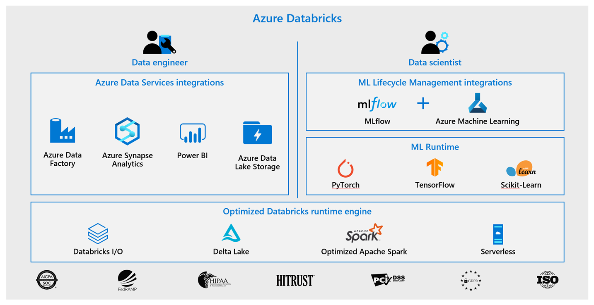
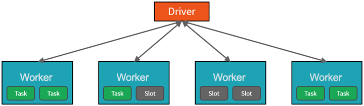
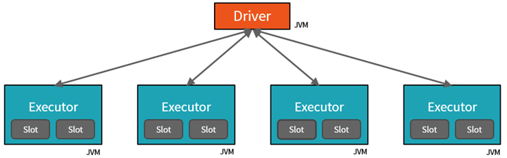
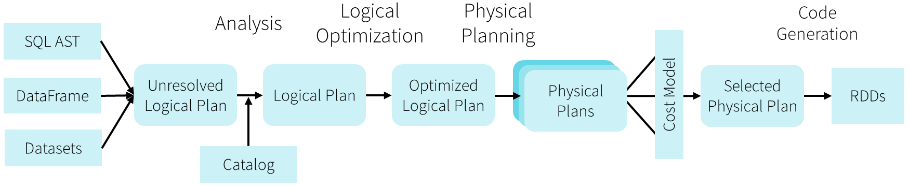

<!-- TOC ignore:true -->
## Table of contents

<!-- TOC -->

- [Microsoft - Data engineering with Azure Databricks](#microsoft---data-engineering-with-azure-databricks)
  - [Link to GitHub repo:](#link-to-github-repo)
- [Describe Azure Databrick](#describe-azure-databrick)
- [Spark architecture fundamentals](#spark-architecture-fundamentals)
  - [The cluster: Drivers, executors, slots & tasks](#the-cluster-drivers-executors-slots--tasks)
  - [Jobs & stages](#jobs--stages)
  - [Cluster management](#cluster-management)
- [Work with DataFrames in Azure Databricks](#work-with-dataframes-in-azure-databricks)
- [Describe lazy evaluation and other performance features in Azure Databricks](#describe-lazy-evaluation-and-other-performance-features-in-azure-databricks)
- [Work with DataFrames columns in Azure Databricks](#work-with-dataframes-columns-in-azure-databricks)
- [Work with DataFrames advanced methods in Azure Databricks](#work-with-dataframes-advanced-methods-in-azure-databricks)
- [Describe platform architecture, security, and data protection in Azure Databricks](#describe-platform-architecture-security-and-data-protection-in-azure-databricks)
- [Build and query a Delta Lake](#build-and-query-a-delta-lake)
- [Process streaming data with Azure Databricks structured streaming](#process-streaming-data-with-azure-databricks-structured-streaming)

<!-- /TOC -->

# Microsoft - Data engineering with Azure Databricks

Learn how to harness the power of Apache Spark and powerful clusters running on the Azure Databricks platform to run large data engineering workloads in the cloud.

This learning path helps prepare you for Exam DP-203: Data Engineering on Microsoft Azure.

- https://docs.microsoft.com/en-us/learn/paths/data-engineer-azure-databricks/

## Link to GitHub repo:

- https://github.com/MicrosoftLearning/microsoft-learning-paths-databricks-notebooks

# Describe Azure Databrick

Azure Databricks is a fully-managed version of the open-source Apache Spark analytics and data processing engine. Azure Databricks is an enterprise-grade and secure cloud-based big data and machine learning platform.

Databricks provides a notebook-oriented Apache Spark as-a-service workspace environment, making it easy to manage clusters and explore data interactively.



- SQL - Closer to ANSI SQL 2003 compliance

  - Now running all 99 TPC-DS queries
  - New standards-compliant parser (with good error messages!)
  - Subqueries (correlated & uncorrelated)
  - Approximate aggregate stats


# Spark architecture fundamentals

**High-level overview**

From a high level, the Azure Databricks service launches and manages Apache Spark clusters within your Azure subscription. Apache Spark clusters are groups of computers that are treated as a single computer and handle the execution of commands issued from notebooks. Using a master-worker type architecture, clusters allow processing of data to be parallelized across many computers to improve scale and performance. They consist of a Spark Driver (master) and worker nodes. The `driver` node sends work to the `worker` nodes and instructs them to pull data from a specified data source.



Internally, Azure Kubernetes Service (AKS) is used to run the Azure Databricks control-plane and data-planes via containers running on the latest generation of Azure hardware (Dv3 VMs), with NvMe SSDs capable of blazing 100us latency on IO. These make Databricks I/O performance even better. In addition, accelerated networking provides the fastest virtualized network infrastructure in the cloud. Azure Databricks utilizes these features to further improve Spark performance. Once the services within this managed resource group are ready, you will be able to manage the Databricks cluster through the Azure Databricks UI and through features such as auto-scaling and auto-termination.


## The cluster: Drivers, executors, slots & tasks



- The Driver is the JVM in which our application runs.
- The secret to Spark's awesome performance is parallelism.
    - Scaling vertically is limited to a finite amount of RAM, Threads and CPU speeds.
    - Scaling horizontally means we can simply add new "nodes" to the cluster almost endlessly.
- We parallelize at two levels:
    - The first level of parallelization is the Executor - a Java virtual machine running on a node, typically, one instance per node.
    - The second level of parallelization is the Slot - the number of which is determined by the number of cores and CPUs of each node.
- Each Executor has a number of Slots to which parallelized Tasks can be assigned to it by the Driver.


## Jobs & stages

- Each parallelized action is referred to as a Job.
- The results of each Job (parallelized/distributed action) is returned to the Driver.
- Depending on the work required, multiple Jobs will be required.
- Each Job is broken down into Stages.
- This would be analogous to building a house (the job)
    - The first stage would be to lay the foundation.
    - The second stage would be to erect the walls.
    - The third stage would be to add the room.
    - Attempting to do any of these steps out of order just won't make sense, if not just impossible.

## Cluster management

- At a much lower level, Spark Core employs a Cluster Manager that is responsible for provisioning nodes in our cluster.
  - Databricks provides a robust, high-performing Cluster Manager as part of its overall offerings.
- In each of these scenarios, the Driver is [presumably] running on one node, with each Executors running on N different nodes.
- For the sake of this learning path, we don't need to concern ourselves with cluster management, thanks to Azure Databricks.
- From a developer's and learner's perspective my primary focus is on...
    - The number of Partitions my data is divided into.
    - The number of Slots I have for parallel execution.
    - How many Jobs am I triggering?
    - And lastly the Stages those jobs are divided into.

```
How do you list files in DBFS within a notebook?

%fs ls /my-file-path
```


# Work with DataFrames in Azure Databricks

Use the `count()` method to count rows in a DataFrame
Use the `display()` function to display a DataFrame in the Notebook
Cache a DataFrame for quicker operations if the data is needed a second time
Use the `limit` function to display a small set of rows from a larger DataFrame
Use `select()` to select a subset of columns from a DataFrame
Use `distinct()` and dropDuplicates to remove duplicate data
Use `drop()` to remove columns from a DataFrame

# Describe lazy evaluation and other performance features in Azure Databricks

Among the most powerful components of Spark are Spark SQL. At its core lies the Catalyst optimizer. This extensible query optimizer supports both rule-based and cost-based optimization.

When you execute code, Spark SQL uses Catalyst's general tree transformation framework in four phases, as shown below: (1) analyzing a logical plan to resolve references, (2) logical plan optimization, (3) physical planning, and (4) code generation to compile parts of the query to Java bytecode. In the physical planning phase, Catalyst may generate multiple plans and compare them based on cost. All other phases are purely rule-based.



# Work with DataFrames columns in Azure Databricks

Exercises based part

# Work with DataFrames advanced methods in Azure Databricks

Exercises based part

Azure Databricks is a fully-managed, cloud-based Big Data and Machine Learning platform, which empowers developers to accelerate AI and innovation by simplifying the process of building enterprise-grade production data applications. Built as a joint effort by Databricks and Microsoft, Azure Databricks provides data science and engineering teams with a single platform for Big Data processing and Machine Learning.

# Describe platform architecture, security, and data protection in Azure Databricks

By combining the power of Databricks, an end-to-end, managed Apache Spark platform optimized for the cloud, with the enterprise scale and security of Microsoft's Azure platform, Azure Databricks makes it simple to run large-scale Spark workloads.


Microsoft is working to integrate Azure Databricks closely with all features of the Azure platform. Below is a list of some of the integrations completed so far:

- VM types: Many existing VMs can be used for clusters, including F-series for machine learning scenarios, M-series for massive memory scenarios, and D-series for general purpose.

- Security and Privacy: Ownership and control of data is with the customer, and Microsoft aims for Azure Databricks to adhere to all the compliance certifications that the rest of Azure provides.
- Flexibility in network topology: Azure Databricks supports deployments into virtual networks (VNETs), which can control which sources and sinks can be accessed and how they are accessed.
- Orchestration: ETL/ELT workflows (including analytics workloads in Azure Databricks) can be operationalized using Azure Data Factory pipelines.
- Power BI: Power BI can be connected directly to Databricks clusters using JDBC in order to query data interactively at massive scale using familiar tools.
- Azure Active Directory: Azure Databricks workspaces deploy into customer subscriptions, so naturally Azure AD can be used to control access to sources, results, and jobs.
- Data stores: Azure Storage and Data Lake Store services are exposed to Databricks users via Databricks File System (DBFS) to provide caching and optimized analysis over existing data. Azure D- atabricks easily and efficiently uploads results into Azure Synapse Analytics, Azure SQL Database, and Azure Cosmos DB for further analysis and real-time serving, making it simple to build end-to-end data architectures on Azure.
- Real-time analytics: Integration with IoT Hub, Azure Event Hubs, and Azure HDInsight Kafka clusters enables developers to build scalable streaming solutions for real-time analytics.

**VNet Peering**

Virtual network (VNet) peering allows the virtual network in which your Azure Databricks resource is running to peer with another Azure virtual network. Traffic between virtual machines in the peered virtual networks is routed through the Microsoft backbone infrastructure, much like traffic is routed between virtual machines in the same virtual network, through private IP addresses only.

# Build and query a Delta Lake

Delta Lake is a transactional storage layer designed specifically to work with Apache Spark and Databricks File System (DBFS). At the core of Delta Lake is an optimized Spark table. It stores your data as Apache Parquet files in DBFS and maintains a transaction log that efficiently tracks changes to the table.

Delta Lake is an open-source storage layer that brings ACID transactions to Apache Spark™ and big data workloads.


You can read and write data that's stored in Delta Lake by using Apache Spark SQL batch and streaming APIs. These are the same familiar APIs that you use to work with Hive tables or DBFS directories. Delta Lake provides the following functionality:

ACID Transactions: Data lakes typically have multiple data pipelines reading and writing data concurrently, and data engineers have to go through a tedious process to ensure data integrity, due to the lack of transactions. Delta Lake brings ACID transactions to your data lakes. It provides serializability, the strongest level of isolation level.

Scalable Metadata Handling: In big data, even the metadata itself can be "big data". Delta Lake treats metadata just like data, leveraging Spark's distributed processing power to handle all its metadata. As a result, Delta Lake can handle petabyte-scale tables with billions of partitions and files at ease.

Time Travel (data versioning): Delta Lake provides snapshots of data enabling developers to access and revert to earlier versions of data for audits, rollbacks or to reproduce experiments.

Open Format: All data in Delta Lake is stored in Apache Parquet format enabling Delta Lake to leverage the efficient compression and encoding schemes that are native to Parquet.

Unified Batch and Streaming Source and Sink: A table in Delta Lake is both a batch table, as well as a streaming source and sink. Streaming data ingest, batch historic backfill, and interactive queries all just work out of the box.

Schema Enforcement: Delta Lake provides the ability to specify your schema and enforce it. This helps ensure that the data types are correct and required columns are present, preventing bad data from causing data corruption.

Schema Evolution: Big data is continuously changing. Delta Lake enables you to make changes to a table schema that can be applied automatically, without the need for cumbersome DDL.

100% Compatible with Apache Spark API: Developers can use Delta Lake with their existing data pipelines with minimal change as it is fully compatible with Spark, the commonly used big data processing engine.

# Process streaming data with Azure Databricks structured streaming

