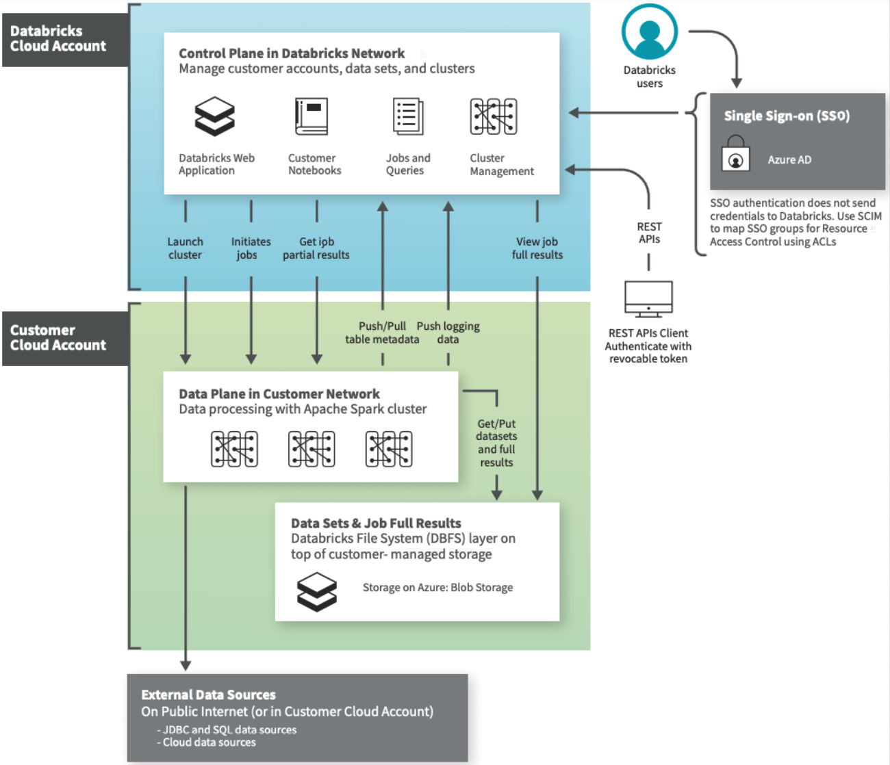

<!-- TOC -->

- [Based on](#based-on)
- [GitHub repo](#github-repo)
- [Chapter1: Creating an Azure Databricks Service](#chapter1-creating-an-azure-databricks-service)
- [Chapter2: Reading and writing data](#chapter2-reading-and-writing-data)

<!-- /TOC -->

# Based on

- https://learning.oreilly.com/library/view/azure-databricks-cookbook/9781789809718/

# GitHub repo

- https://github.com/PacktPublishing/Azure-Databricks-Cookbook

# Chapter1: Creating an Azure Databricks Service

When we create an Azure Databricks service, it operates in the control plane and the data plane:

Using ARM templates for deployment is a well known method to deploy resource in Azure.

By the end of this recipe, you will have learned how to deploy an Azure Databricks workspace using ARM templates. ARM templates can be deployed from an Azure DevOps pipeline, as well as by using PowerShell or CLI commands.

**Cluster sizing considerations**

Total executor cores (compute): The total number of cores across all executors. This determines the maximum parallelism of a cluster.

Total executor memory: The total amount of RAM across all executors. This determines how much data can be stored in memory before spilling it to disk.

Executor local storage: The type and amount of local disk storage. Local disk is primarily used in the case of spills during shuffles and caching.

**Best practices: Cluster configuration**

https://docs.microsoft.com/en-us/azure/databricks/clusters/cluster-config-best-practices#cluster-sizing-considerations%20

# Chapter2: Reading and writing data

https://learning.oreilly.com/library/view/azure-databricks-cookbook/9781789809718/B12761_02_Final_SS_ePub.xhtml#_idParaDest-89

