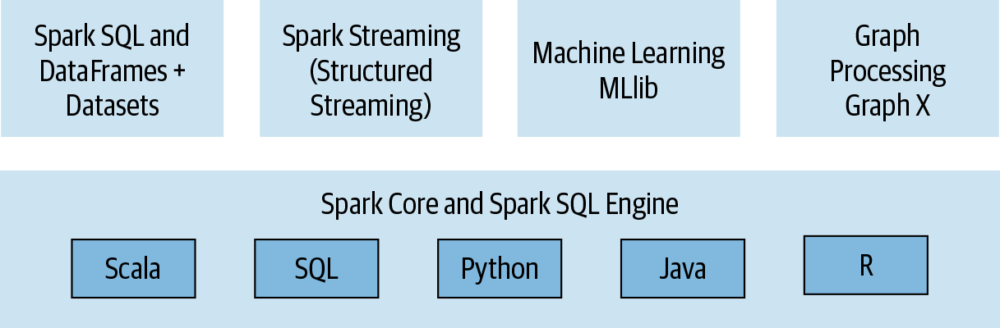
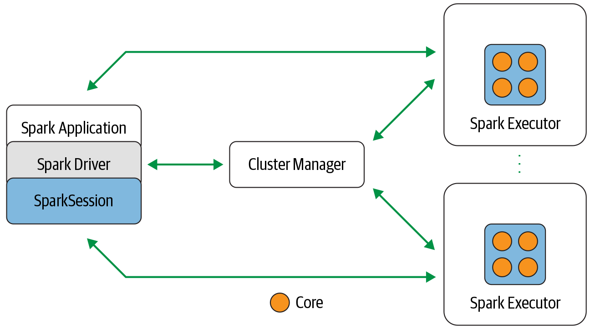
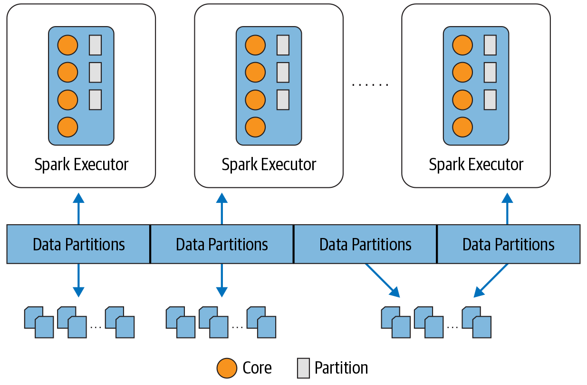
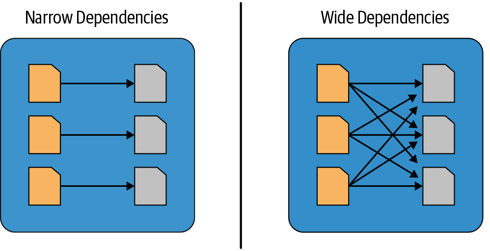
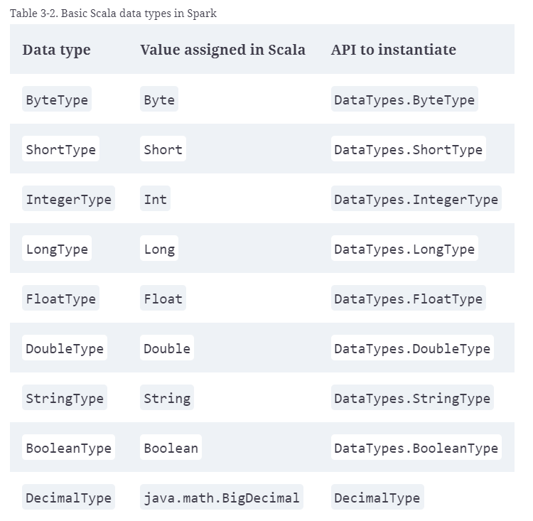
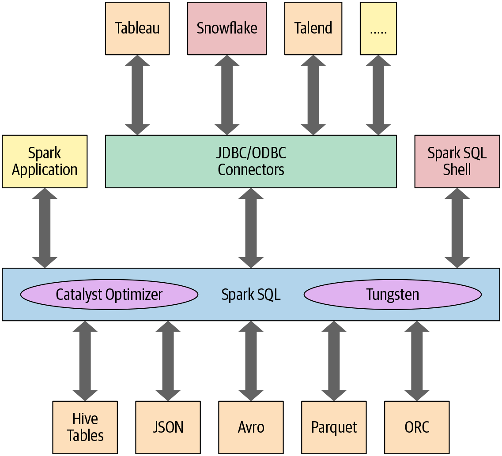
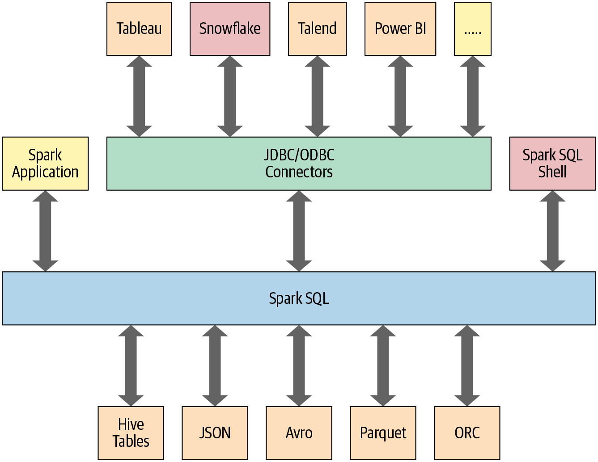

<!-- TOC -->

- [What Is Apache Spark?](#what-is-apache-spark)
  - [Spark SQL](#spark-sql)
  - [Spark MLlib](#spark-mllib)
  - [Spark Structured Streaming](#spark-structured-streaming)
  - [GraphX](#graphx)
  - [Apache Spark’s Distributed Execution](#apache-sparks-distributed-execution)
  - [Spark driver](#spark-driver)
  - [Distributed data and partitions](#distributed-data-and-partitions)
- [Downloading Apache Spark](#downloading-apache-spark)
- [Understanding Spark Application Concepts](#understanding-spark-application-concepts)
  - [Transformations, Actions, and Lazy Evaluation](#transformations-actions-and-lazy-evaluation)
  - [Narrow and Wide Transformations](#narrow-and-wide-transformations)
- [Apache Spark’s Structured APIs](#apache-sparks-structured-apis)
  - [Spark’s Basic Data Types](#sparks-basic-data-types)
  - [Schemas and Creating DataFrames](#schemas-and-creating-dataframes)
  - [Columns and Expressions](#columns-and-expressions)
  - [Rows](#rows)
  - [Common DataFrame Operations](#common-dataframe-operations)
    - [Saving a DataFrame as a Parquet file or SQL table](#saving-a-dataframe-as-a-parquet-file-or-sql-table)
  - [Projections and filters](#projections-and-filters)
  - [Renaming, adding, and dropping columns](#renaming-adding-and-dropping-columns)
  - [When to Use RDDs](#when-to-use-rdds)
  - [DataFrames Versus Datasets](#dataframes-versus-datasets)
- [Spark SQL and the Underlying Engine](#spark-sql-and-the-underlying-engine)
    - [Phase 1: Analysis](#phase-1-analysis)
    - [Phase 2: Logical optimization](#phase-2-logical-optimization)
    - [Phase 3: Physical planning](#phase-3-physical-planning)
    - [Phase 4: Code generation](#phase-4-code-generation)
- [Spark SQL and DataFrames: Introduction to Built-in Data Sources](#spark-sql-and-dataframes-introduction-to-built-in-data-sources)
  - [Using Spark SQL in Spark Applications](#using-spark-sql-in-spark-applications)
  - [SQL Tables and Views](#sql-tables-and-views)
  - [Creating Views](#creating-views)
  - [Reading Tables into DataFrames](#reading-tables-into-dataframes)
  - [DataFrameReader](#dataframereader)
  - [DataFrameWriter](#dataframewriter)
  - [Parquet Files](#parquet-files)
  - [Reading Parquet files into a Spark SQL table](#reading-parquet-files-into-a-spark-sql-table)
  - [Avro](#avro)
  - [Binary Files](#binary-files)
- [Spark SQL and DataFrames: Interacting with External Data Sources](#spark-sql-and-dataframes-interacting-with-external-data-sources)
  - [Spark SQL and Apache Hive](#spark-sql-and-apache-hive)
  - [Spark SQL UDFs](#spark-sql-udfs)
  - [Querying with the Spark SQL Shell, Beeline, and Tableau](#querying-with-the-spark-sql-shell-beeline-and-tableau)
  - [External Data Sources](#external-data-sources)
- [Spark SQL and Datasets](#spark-sql-and-datasets)

<!-- /TOC -->

# What Is Apache Spark?

Apache Spark is a unified engine designed for large-scale distributed data processing, on premises in data centers or in the cloud.

Spark provides in-memory storage for intermediate computations, making it much faster than Hadoop MapReduce. It incorporates libraries with composable APIs for machine learning (MLlib), SQL for interactive queries (Spark SQL), stream processing (Structured Streaming) for interacting with real-time data, and graph processing (GraphX).

[Third-party Spark packages](https://spark.apache.org/third-party-projects.html)

Spark offers four distinct components as libraries for diverse workloads: Spark SQL, Spark MLlib, Spark Structured Streaming, and GraphX. Each of these components is separate from Spark’s core fault-tolerant engine, in that you use APIs to write your Spark application and Spark converts this into a DAG that is executed by the core engine.



## Spark SQL

This module works well with structured data. You can read data stored in an RDBMS table or from file formats with structured data (CSV, text, JSON, Avro, ORC, Parquet, etc.) and then construct permanent or temporary tables in Spark. Also, when using Spark’s Structured APIs in Java, Python, Scala, or R, you can combine SQL-like queries to query the data just read into a Spark DataFrame. To date, Spark SQL is ANSI SQL:2003-compliant and it also functions as a pure SQL engine.

## Spark MLlib

Spark comes with a library containing common machine learning (ML) algorithms called MLlib. Since Spark’s first release, the performance of this library component has improved significantly because of Spark 2.x’s underlying engine enhancements. MLlib provides many popular machine learning algorithms built atop high-level DataFrame-based APIs to build models

## Spark Structured Streaming

Apache Spark 2.0 introduced an experimental Continuous Streaming model and Structured Streaming APIs, built atop the Spark SQL engine and DataFrame-based APIs. By Spark 2.2, Structured Streaming was generally available, meaning that developers could use it in their production environments.

## GraphX

As the name suggests, GraphX is a library for manipulating graphs (e.g., social network graphs, routes and connection points, or network topology graphs) and performing graph-parallel computations. It offers the standard graph algorithms for analysis, connections, and traversals, contributed by users in the community: the available algorithms include PageRank, Connected Components, and Triangle Counting.

## Apache Spark’s Distributed Execution

If you have read this far, you already know that Spark is a distributed data processing engine with its components working collaboratively on a cluster of machines. Before we explore programming with Spark in the following chapters of this book, you need to understand how all the components of Spark’s distributed architecture work together and communicate, and what deployment modes are available.



## Spark driver

As the part of the Spark application responsible for instantiating a SparkSession, the Spark driver has multiple roles: it communicates with the cluster manager; it requests resources (CPU, memory, etc.) from the cluster manager for Spark’s executors (JVMs); and it transforms all the Spark operations into DAG computations, schedules them, and distributes their execution as tasks across the Spark executors. Once the resources are allocated, it communicates directly with the executors.

## Distributed data and partitions

Actual physical data is distributed across storage as partitions residing in either HDFS or cloud storage. While the data is distributed as partitions across the physical cluster, Spark treats each partition as a high-level logical data abstraction—as a DataFrame in memory. Though this is not always possible, each Spark executor is preferably allocated a task that requires it to read the partition closest to it in the network, observing data locality.


Partitioning allows for efficient parallelism. A distributed scheme of breaking up data into chunks or partitions allows Spark executors to process only data that is close to them, minimizing network bandwidth



# Downloading Apache Spark

Instruction:

https://learning.oreilly.com/library/view/learning-spark-2nd/9781492050032/ch02.html#:-:text=Chapter%202.%20Downloading%20Apache%20Spark%20and%20Getting%20Started

Since the release of Apache Spark 2.2, developers who only care about learning Spark in Python have the option of installing PySpark from the PyPI repository. If you only program in Python, you don’t have to install all the other libraries necessary to run Scala, Java, or R; this makes the binary smaller. To install PySpark from PyPI, just run `pip install pyspark`.

There are some extra dependencies that can be installed for SQL, ML, and MLlib, via `pip install pyspark[sql,ml,mllib]` (or `pip install pyspark[sql]` if you only want the SQL dependencies).

# Understanding Spark Application Concepts

**Application**

A user program built on Spark using its APIs. It consists of a driver program and executors on the cluster.

**SparkSession**

An object that provides a point of entry to interact with underlying Spark functionality and allows programming Spark with its APIs. In an interactive Spark shell, the Spark driver instantiates a SparkSession for you, while in a Spark application, you create a SparkSession object yourself.

**Job**

A parallel computation consisting of multiple tasks that gets spawned in response to a Spark action (e.g., `save(),` `collect())`.

**Stage**

Each job gets divided into smaller sets of tasks called stages that depend on each other.

**Task**

A single unit of work or execution that will be sent to a Spark executor.

At the core of every Spark application is the Spark driver program, which creates a SparkSession object. When you’re working with a Spark shell, the driver is part of the shell and the SparkSession object (accessible via the variable spark) is created for you, as you saw in the earlier examples when you launched the shells.

## Transformations, Actions, and Lazy Evaluation

Spark operations on distributed data can be classified into two types: transformations and actions. Transformations, as the name suggests, transform a Spark DataFrame into a new DataFrame without altering the original data, giving it the property of immutability. Put another way, an operation such as select() or filter() will not change the original DataFrame; instead, it will return the transformed results of the operation as a new DataFrame.

All transformations are evaluated lazily. That is, their results are not computed immediately, but they are recorded or remembered as a lineage. A recorded lineage allows Spark, at a later time in its execution plan, to rearrange certain transformations, coalesce them, or optimize transformations into stages for more efficient execution. Lazy evaluation is Spark’s strategy for delaying execution until an action is invoked or data is “touched” (read from or written to disk).

## Narrow and Wide Transformations

As noted, transformations are operations that Spark evaluates lazily. A huge advantage of the lazy evaluation scheme is that Spark can inspect your computational query and ascertain how it can optimize it. This optimization can be done by either joining or pipelining some operations and assigning them to a stage, or breaking them into stages by determining which operations require a shuffle or exchange of data across clusters.

Transformations can be classified as having either narrow dependencies or wide dependencies. Any transformation where a single output partition can be computed from a single input partition is a narrow transformation. For example, in the previous code snippet, `filter()` and `contains()` represent narrow transformations because they can operate on a single partition and produce the resulting output partition without any exchange of data.

However, `groupBy()` or `orderBy()` instruct Spark to perform wide transformations, where data from other partitions is read in, combined, and written to disk. Since each partition will have its own count of the word that contains the “Spark” word in its row of data, a count (`groupBy()`) will force a shuffle of data from each of the executor’s partitions across the cluster. In this transformation, `orderBy()` requires output from other partitions to compute the final aggregation.



# Apache Spark’s Structured APIs

The RDD is the most basic abstraction in Spark. There are three vital characteristics associated with an RDD:

- Dependencies

- Partitions (with some locality information)

- Compute function: Partition => Iterator[T]

All three are integral to the simple RDD programming API model upon which all higher-level functionality is constructed. First, a list of dependencies that instructs Spark how an RDD is constructed with its inputs is required. When necessary to reproduce results, Spark can recreate an RDD from these dependencies and replicate operations on it. This characteristic gives RDDs resiliency.

Second, partitions provide Spark the ability to split the work to parallelize computation on partitions across executors. In some cases—for example, reading from HDFS—Spark will use locality information to send work to executors close to the data. That way less data is transmitted over the network.

And finally, an RDD has a compute function that produces an `Iterator[T]` for the data that will be stored in the RDD.

```
# In Python
from pyspark.sql import SparkSession
from pyspark.sql.functions import avg
# Create a DataFrame using SparkSession
spark = (SparkSession
  .builder
  .appName("AuthorsAges")
  .getOrCreate())
# Create a DataFrame
data_df = spark.createDataFrame([("Brooke", 20), ("Denny", 31), ("Jules", 30),
  ("TD", 35), ("Brooke", 25)], ["name", "age"])
# Group the same names together, aggregate their ages, and compute an average
avg_df = data_df.groupBy("name").agg(avg("age"))
# Show the results of the final execution
avg_df.show()
```

## Spark’s Basic Data Types

Matching its supported programming languages, Spark supports basic internal data types. These data types can be declared in your Spark application or defined in your schema. For example, in Scala, you can define or declare a particular column name to be of type String, Byte, Long, or Map, etc. Here, we define variable names tied to a Spark data type:



## Schemas and Creating DataFrames

A schema in Spark defines the column names and associated data types for a DataFrame. Most often, schemas come into play when you are reading structured data from an external data source (more on this in the next chapter). Defining a schema up front as opposed to taking a schema-on-read approach offers three benefits:

- You relieve Spark from the onus of inferring data types.

- You prevent Spark from creating a separate job just to read a large portion of your file to ascertain the schema, which for a large data file can be expensive and time-consuming.

- You can detect errors early if data doesn’t match the schema.

So, we encourage you to always define your schema up front whenever you want to read a large file from a data source.

To define a schema programmatically for a DataFrame with three named columns, author, title, and pages, you can use the Spark DataFrame API. For example:

```
# In Python
schema = "author STRING, title STRING, pages INT"
```

You can choose whichever way you like to define a schema. For many examples, we will use both:

```
# In Python
from pyspark.sql import SparkSession

# Define schema for our data using DDL
schema = "`Id` INT, `First` STRING, `Last` STRING, `Url` STRING,
  `Published` STRING, `Hits` INT, `Campaigns` ARRAY<STRING>"

# Create our static data
data = [[1, "Jules", "Damji", "https://tinyurl.1", "1/4/2016", 4535, ["twitter",
"LinkedIn"]],
       [2, "Brooke","Wenig", "https://tinyurl.2", "5/5/2018", 8908, ["twitter",
"LinkedIn"]],
       [3, "Denny", "Lee", "https://tinyurl.3", "6/7/2019", 7659, ["web",
"twitter", "FB", "LinkedIn"]],
       [4, "Tathagata", "Das", "https://tinyurl.4", "5/12/2018", 10568,
["twitter", "FB"]],
       [5, "Matei","Zaharia", "https://tinyurl.5", "5/14/2014", 40578, ["web",
"twitter", "FB", "LinkedIn"]],
       [6, "Reynold", "Xin", "https://tinyurl.6", "3/2/2015", 25568,
["twitter", "LinkedIn"]]
      ]

# Main program
if __name__ == "__main__":
   # Create a SparkSession
   spark = (SparkSession
     .builder
     .appName("Example-3_6")
     .getOrCreate())
   # Create a DataFrame using the schema defined above
   blogs_df = spark.createDataFrame(data, schema)
   # Show the DataFrame; it should reflect our table above
   blogs_df.show()
   # Print the schema used by Spark to process the DataFrame
   print(blogs_df.printSchema())

```

## Columns and Expressions

As mentioned previously, named columns in DataFrames are conceptually similar to named columns in pandas or R DataFrames or in an RDBMS table: they describe a type of field. You can list all the columns by their names, and you can perform operations on their values using relational or computational expressions. In Spark’s supported languages, columns are objects with public methods (represented by the `Column` type).

## Rows

A row in Spark is a generic Row object, containing one or more columns. Each column may be of the same data type (e.g., integer or string), or they can have different types (integer, string, map, array, etc.). Because Row is an object in Spark and an ordered collection of fields, you can instantiate a Row in each of Spark’s supported languages and access its fields by an index starting at 0

## Common DataFrame Operations

To perform common data operations on DataFrames, you’ll first need to load a DataFrame from a data source that holds your structured data. Spark provides an interface, `DataFrameReader`, that enables you to read data into a DataFrame from myriad data sources in formats such as JSON, CSV, Parquet, Text, Avro, ORC, etc. Likewise, to write a DataFrame back to a data source in a particular format, Spark uses `DataFrameWriter`.

```
# In Python, define a schema
from pyspark.sql.types import *

# Programmatic way to define a schema
fire_schema = StructType([StructField('CallNumber', IntegerType(), True),
                StructField('UnitID', StringType(), True),
                StructField('IncidentNumber', IntegerType(), True),
                StructField('CallType', StringType(), True),
                StructField('CallDate', StringType(), True),
                StructField('WatchDate', StringType(), True),
                StructField('CallFinalDisposition', StringType(), True),
                StructField('AvailableDtTm', StringType(), True),
                StructField('Address', StringType(), True),
                StructField('City', StringType(), True),
                StructField('Zipcode', IntegerType(), True),
                StructField('Battalion', StringType(), True),
                StructField('StationArea', StringType(), True),
                StructField('Box', StringType(), True),
                StructField('OriginalPriority', StringType(), True),
                StructField('Priority', StringType(), True),
                StructField('FinalPriority', IntegerType(), True),
                StructField('ALSUnit', BooleanType(), True),
                StructField('CallTypeGroup', StringType(), True),
                StructField('NumAlarms', IntegerType(), True),
                StructField('UnitType', StringType(), True),
                StructField('UnitSequenceInCallDispatch', IntegerType(), True),
                StructField('FirePreventionDistrict', StringType(), True),
                StructField('SupervisorDistrict', StringType(), True),
                StructField('Neighborhood', StringType(), True),
                StructField('Location', StringType(), True),
                StructField('RowID', StringType(), True),
                StructField('Delay', FloatType(), True)])

# Use the DataFrameReader interface to read a CSV file
sf_fire_file = "/databricks-datasets/learning-spark-v2/sf-fire/sf-fire-calls.csv"
fire_df = spark.read.csv(sf_fire_file, header=True, schema=fire_schema)
```

### Saving a DataFrame as a Parquet file or SQL table

A common data operation is to explore and transform your data, and then persist the DataFrame in Parquet format or save it as a SQL table. Persisting a transformed DataFrame is as easy as reading it. For example, to persist the DataFrame we were just working with as a file after reading it you would do the following:

```
# In Python to save as a Parquet file
parquet_path = ...
fire_df.write.format("parquet").save(parquet_path)
```

## Projections and filters

A projection in relational parlance is a way to return only the rows matching a certain relational condition by using filters. In Spark, projections are done with the select() method, while filters can be expressed using the filter() or where() method. We can use this technique to examine specific aspects of our SF Fire Department data set:

```
# In Python, return number of distinct types of calls using countDistinct()
from pyspark.sql.functions import *
(fire_df
  .select("CallType")
  .where(col("CallType").isNotNull())
  .agg(countDistinct("CallType").alias("DistinctCallTypes"))
  .show())
```

## Renaming, adding, and dropping columns

Sometimes you want to rename particular columns for reasons of style or convention, and at other times for readability or brevity.

Because DataFrame transformations are immutable, when we rename a column using `withColumnRenamed()` we get a new DataFrame while retaining the original with the old column name.

```
# In Python
fire_ts_df = (new_fire_df
  .withColumn("IncidentDate", to_timestamp(col("CallDate"), "MM/dd/yyyy"))
  .drop("CallDate")
  .withColumn("OnWatchDate", to_timestamp(col("WatchDate"), "MM/dd/yyyy"))
  .drop("WatchDate")
  .withColumn("AvailableDtTS", to_timestamp(col("AvailableDtTm"),
  "MM/dd/yyyy hh:mm:ss a"))
  .drop("AvailableDtTm"))

# Select the converted columns
(fire_ts_df
  .select("IncidentDate", "OnWatchDate", "AvailableDtTS")
  .show(5, False))
```

Let’s take our first question: what were the most common types of fire calls?

```# In Python
(fire_ts_df
  .select("CallType")
  .where(col("CallType").isNotNull())
  .groupBy("CallType")
  .count()
  .orderBy("count", ascending=False)
  .show(n=10, truncate=False))
```

## When to Use RDDs

You may ask: Are RDDs being relegated to second-class citizens? Are they being deprecated? The answer is a resounding no! The RDD API will continue to be supported, although all future development work in Spark 2.x and Spark 3.0 will continue to have a DataFrame interface and semantics rather than using RDDs.

- There are some scenarios where you’ll want to consider using RDDs, such as when you:

Are using a third-party package that’s written using RDDs

- Can forgo the code optimization, efficient space utilization, and performance benefits available with DataFrames and Datasets

- Want to precisely instruct Spark how to do a query

## DataFrames Versus Datasets

By now you may be wondering why and when you should use DataFrames or Datasets. In many cases either will do, depending on the languages you are working in, but there are some situations where one is preferable to the other. Here are a few examples:

- If you want to tell Spark what to do, not how to do it, use DataFrames or Datasets.

- If you want rich semantics, high-level abstractions, and DSL operators, use DataFrames or Datasets.

- If you want strict compile-time type safety and don’t mind creating multiple case classes for a specific Dataset[T], use Datasets.

- If your processing demands high-level expressions, filters, maps, aggregations, computing averages or sums, SQL queries, columnar access, or use of relational operators on semi-structured data, use DataFrames or Datasets.

- If your processing dictates relational transformations similar to SQL-like queries, use DataFrames.

- If you want to take advantage of and benefit from Tungsten’s efficient serialization with Encoders, , use Datasets.

- If you want unification, code optimization, and simplification of APIs across Spark components, use DataFrames.

- If you are an R user, use DataFrames.

- If you are a Python user, use DataFrames and drop down to RDDs if you need more control.

- If you want space and speed efficiency, use DataFrames.

- If you want errors caught during compilation rather than at runtime, choose the appropriate API

# Spark SQL and the Underlying Engine

At a programmatic level, Spark SQL allows developers to issue ANSI SQL:2003–compatible queries on structured data with a schema. Since its introduction in Spark 1.3, Spark SQL has evolved into a substantial engine upon which many high-level structured functionalities have been built. Apart from allowing you to issue SQL-like queries on your data, the Spark SQL engine:

- Unifies Spark components and permits abstraction to DataFrames/Datasets in Java, Scala, Python, and R, which simplifies working with structured data sets.

- Connects to the Apache Hive metastore and tables.

- Reads and writes structured data with a specific schema from structured file formats (JSON, CSV, Text, Avro, Parquet, ORC, etc.) and converts data into temporary tables.

- Offers an interactive Spark SQL shell for quick data exploration.

- Provides a bridge to (and from) external tools via standard database JDBC/ODBC connectors.

- Generates optimized query plans and compact code for the JVM, for final execution.



Let’s go through each of the four query optimization phases..

### Phase 1: Analysis

The Spark SQL engine begins by generating an abstract syntax tree (AST) for the SQL or DataFrame query. In this initial phase, any columns or table names will be resolved by consulting an internal Catalog, a programmatic interface to Spark SQL that holds a list of names of columns, data types, functions, tables, databases, etc. Once they’ve all been successfully resolved, the query proceeds to the next phase.

### Phase 2: Logical optimization

As Figure 3-4 shows, this phase comprises two internal stages. Applying a standard-rule based optimization approach, the Catalyst optimizer will first construct a set of multiple plans and then, using its cost-based optimizer (CBO), assign costs to each plan. These plans are laid out as operator trees (like in Figure 3-5); they may include, for example, the process of constant folding, predicate pushdown, projection pruning, Boolean expression simplification, etc. This logical plan is the input into the physical plan.

### Phase 3: Physical planning

In this phase, Spark SQL generates an optimal physical plan for the selected logical plan, using physical operators that match those available in the Spark execution engine.

### Phase 4: Code generation

The final phase of query optimization involves generating efficient Java bytecode to run on each machine. Because Spark SQL can operate on data sets loaded in memory, Spark can use state-of-the-art compiler technology for code generation to speed up execution. In other words, it acts as a compiler. Project Tungsten, which facilitates whole-stage code generation, plays a role here.

Just what is whole-stage code generation? It’s a physical query optimization phase that collapses the whole query into a single function, getting rid of virtual function calls and employing CPU registers for intermediate data. The second-generation Tungsten engine, introduced in Spark 2.0, uses this approach to generate compact RDD code for final execution. This streamlined strategy significantly improves CPU efficiency and performance.

# Spark SQL and DataFrames: Introduction to Built-in Data Sources



**In particular, Spark SQL:**

Provides the engine upon which the high-level Structured APIs we explored in Chapter 3 are built.

Can read and write data in a variety of structured formats (e.g., JSON, Hive tables, Parquet, Avro, ORC, CSV).

Lets you query data using JDBC/ODBC connectors from external business intelligence (BI) data sources such as Tableau, Power BI, Talend, or from RDBMSs such as MySQL and PostgreSQL.

Provides a programmatic interface to interact with structured data stored as tables or views in a database from a Spark application

Offers an interactive shell to issue SQL queries on your structured data.

Supports ANSI SQL:2003-compliant commands and HiveQL.

## Using Spark SQL in Spark Applications

The `SparkSession`, introduced in Spark 2.0, provides a unified entry point for programming Spark with the Structured APIs. You can use a `SparkSession` to access Spark functionality: just import the class and create an instance in your code.

To issue any SQL query, use the `sql()` method on the SparkSession instance, spark, such as:

`spark.sql("SELECT * FROM myTableName")`

. All spark.sql queries executed in this manner return a DataFrame on which you may perform further Spark operations if you desire—the kind we explored in Chapter 3 and the ones you will learn about in this chapter and the next.

Normally, in a standalone Spark application, you will create a `SparkSession` instance manually, as shown in the following example. However, in a Spark shell (or Databricks notebook), the `SparkSession` is created for you and accessible via the appropriately named variable `spark`.

**Let’s get started by reading the data set into a temporary view:**

```
# In Python
from pyspark.sql import SparkSession
# Create a SparkSession
spark = (SparkSession
  .builder
  .appName("SparkSQLExampleApp")
  .getOrCreate())

# Path to data set
csv_file = "/databricks-datasets/learning-spark-v2/flights/departuredelays.csv"

# Read and create a temporary view
# Infer schema (note that for larger files you
# may want to specify the schema)
df = (spark.read.format("csv")
  .option("inferSchema", "true")
  .option("header", "true")
  .load(csv_file))
df.createOrReplaceTempView("us_delay_flights_tbl")
```

Another example:

```
spark.sql("""SELECT distance, origin, destination
FROM us_delay_flights_tbl WHERE distance > 1000
ORDER BY distance DESC""").show(10)
```

Example of CASE:

https://learning.oreilly.com/library/view/learning-spark-2nd/9781492050032/ch04.html#:-:text=Let%E2%80%99s%20try%20a%20more%20complicated%20query%20where%20we%20use

```
spark.sql("""SELECT delay, origin, destination,
              CASE
                  WHEN delay > 360 THEN 'Very Long Delays'
                  WHEN delay >= 120 AND delay <= 360 THEN 'Long Delays'
                  WHEN delay >= 60 AND delay < 120 THEN 'Short Delays'
                  WHEN delay > 0 and delay < 60 THEN 'Tolerable Delays'
                  WHEN delay = 0 THEN 'No Delays'
                  ELSE 'Early'
               END AS Flight_Delays
               FROM us_delay_flights_tbl
               ORDER BY origin, delay DESC""").show(10)

```

## SQL Tables and Views

Tables hold data. Associated with each table in Spark is its relevant metadata, which is information about the table and its data: the schema, description, table name, database name, column names, partitions, physical location where the actual data resides, etc. All of this is stored in a central metastore.

Instead of having a separate metastore for Spark tables, Spark by default uses the Apache Hive metastore, located at /user/hive/warehouse, to persist all the metadata about your tables. However, you may change the default location by setting the Spark config variable `spark.sql.warehouse.dir` to another location, which can be set to a local or external distributed storage

## Creating Views

https://docs.databricks.com/spark/latest/spark-sql/language-manual/sql-ref-syntax-ddl-create-view.html#create-view

In addition to creating tables, Spark can create views on top of existing tables. Views can be global (visible across all SparkSessions on a given cluster) or session-scoped (visible only to a single SparkSession), and they are temporary: they disappear after your Spark application terminates.

Creating views has a similar syntax to creating tables within a database. Once you create a view, you can query it as you would a table. The difference between a view and a table is that views don’t actually hold the data; tables persist after your Spark application terminates, but views disappear.

**Temporary views versus global temporary views**

The difference between temporary and global temporary views being subtle, it can be a source of mild confusion among developers new to Spark. A temporary view is tied to a single SparkSession within a Spark application. In contrast, a global temporary view is visible across multiple SparkSessions within a Spark application. Yes, you can create multiple SparkSessions within a single Spark application—this can be handy, for example, in cases where you want to access (and combine) data from two different SparkSessions that don’t share the same Hive metastore configurations.

https://learning.oreilly.com/library/view/learning-spark-2nd/9781492050032/ch04.html#:-:text=You%20can%20create,of%20the%20table%3A

```
-- In SQL
CREATE OR REPLACE GLOBAL TEMP VIEW us_origin_airport_SFO_global_tmp_view AS
  SELECT date, delay, origin, destination from us_delay_flights_tbl WHERE
  origin = 'SFO';

CREATE OR REPLACE TEMP VIEW us_origin_airport_JFK_tmp_view AS
  SELECT date, delay, origin, destination from us_delay_flights_tbl WHERE
  origin = 'JFK'
```

## Reading Tables into DataFrames

Often, data engineers build data pipelines as part of their regular data ingestion and ETL processes. They populate Spark SQL databases and tables with cleansed data for consumption by applications downstream.

Let’s assume you have an existing database, `learn_spark_db`, and table, `us_delay_flights_tbl`, ready for use. Instead of reading from an external JSON file, you can simply use SQL to query the table and assign the returned result to a DataFrame:

```
# In Python
us_flights_df = spark.sql("SELECT * FROM us_delay_flights_tbl")
us_flights_df2 = spark.table("us_delay_flights_tbl")
```

Spark SQL Data Sources API: Unified Data Access for the Apache Spark Platform

https://www.databricks.com/blog/2015/01/09/spark-sql-data-sources-api-unified-data-access-for-the-spark-platform.html

## DataFrameReader

`DataFrameReader` is the core construct for reading data from a data source into a DataFrame. It has a defined format and a recommended pattern for usage:

```
DataFrameReader.format(args).option("key", "value").schema(args).load()
```

Generic Load/Save Functions

https://spark.apache.org/docs/latest/sql-data-sources-load-save-functions.html#manually-specifying-options

## DataFrameWriter

DataFrameWriter does the reverse of its counterpart: it saves or writes data to a specified built-in data source. Unlike with DataFrameReader, you access its instance not from a SparkSession but from the DataFrame you wish to save. It has a few recommended usage patterns:

```DataFrameWriter.format(args)
  .option(args)
  .bucketBy(args)
  .partitionBy(args)
  .save(path)

DataFrameWriter.format(args).option(args).sortBy(args).saveAsTable(table)
```

## Parquet Files

https://spark.apache.org/docs/latest/sql-data-sources-parquet.html

We’ll start our exploration of data sources with Parquet, because it’s the default data source in Spark. Supported and widely used by many big data processing frameworks and platforms, Parquet is an open source columnar file format that offers many I/O optimizations (such as compression, which saves storage space and allows for quick access to data columns).

Because of its efficiency and these optimizations, we recommend that after you have transformed and cleansed your data, you save your DataFrames in the Parquet format for downstream consumption.

Parquet - GitHub Repo:

https://github.com/apache/parquet-format#file-format

To read Parquet files into a DataFrame, you simply specify the format and path:

```
# In Python
file = """/databricks-datasets/learning-spark-v2/flights/summary-data/parquet/
  2010-summary.parquet/"""
df = spark.read.format("parquet").load(file)
```

## Reading Parquet files into a Spark SQL table

As well as reading Parquet files into a Spark DataFrame, you can also create a Spark SQL unmanaged table or view directly using SQL:

```
-- In SQL
CREATE OR REPLACE TEMPORARY VIEW us_delay_flights_tbl
    USING parquet
    OPTIONS (
      path "/databricks-datasets/learning-spark-v2/flights/summary-data/parquet/
      2010-summary.parquet/" )
```

Once you’ve created the table or view, you can read data into a DataFrame using SQL, as we saw in some earlier examples:

```
# In Python
spark.sql("SELECT * FROM us_delay_flights_tbl").show()
```

## Avro

Introduced in Spark 2.4 as a built-in data source, the Avro format is used, for example, by Apache Kafka for message serializing and deserializing. It offers many benefits, including direct mapping to JSON, speed and efficiency, and bindings available for many programming languages.

## Binary Files

Spark 3.0 adds support for binary files as a data source. The DataFrameReader converts each binary file into a single DataFrame row (record) that contains the raw content and metadata of the file. The binary file data source produces a DataFrame with the following columns:

path: StringType

modificationTime: TimestampType

length: LongType

content: BinaryType

# Spark SQL and DataFrames: Interacting with External Data Sources

## Spark SQL and Apache Hive

Spark SQL is a foundational component of Apache Spark that integrates relational processing with Spark’s functional programming API. Its genesis was in previous work on Shark. Shark was originally built on the Hive codebase on top of Apache Spark1 and became one of the first interactive SQL query engines on Hadoop systems. It demonstrated that it was possible to have the best of both worlds; as fast as an enterprise data warehouse, and scaling as well as Hive/MapReduce.

Spark SQL lets Spark programmers leverage the benefits of faster performance and relational programming (e.g., declarative queries and optimized storage), as well as call complex analytics libraries (e.g., machine learning). As discussed in the previous chapter, as of Apache Spark 2.x, the SparkSession provides a single unified entry point to manipulate data in Spark.

## Spark SQL UDFs

The benefit of creating your own PySpark or Scala UDFs is that you (and others) will be able to make use of them within Spark SQL itself. For example, a data scientist can wrap an ML model within a UDF so that a data analyst can query its predictions in Spark SQL without necessarily understanding the internals of the model.

Here’s a simplified example of creating a Spark SQL UDF. Note that UDFs operate per session and they will not be persisted in the underlying metastore:

```
# In Python
from pyspark.sql.types import LongType

# Create cubed function
def cubed(s):
  return s * s * s

# Register UDF
spark.udf.register("cubed", cubed, LongType())

# Generate temporary view
spark.range(1, 9).createOrReplaceTempView("udf_test")
```

pandas user-defined functions

https://docs.databricks.com/spark/latest/spark-sql/udf-python-pandas.html

## Querying with the Spark SQL Shell, Beeline, and Tableau

https://learning.oreilly.com/library/view/learning-spark-2nd/9781492050032/ch05.html#:-:text=Querying%20with%20the%20Spark%20SQL%20Shell%2C%20Beeline%2C%20and%20Tableau

There are various mechanisms to query Apache Spark, including the Spark SQL shell, the Beeline CLI utility, and reporting tools like Tableau and Power BI.

In this section, we include instructions for Tableau; for Power BI, please refer to the documentation.

- Configure the Databricks ODBC and JDBC drivers

https://docs.microsoft.com/en-gb/azure/databricks/integrations/bi/jdbc-odbc-bi


## External Data Sources

https://learning.oreilly.com/library/view/learning-spark-2nd/9781492050032/ch05.html#:-:text=External%20Data%20Sources

In this section, we will focus on how to use Spark SQL to connect to external data sources, starting with JDBC and SQL databases.

JDBC and SQL Databases
Spark SQL includes a data source API that can read data from other databases using JDBC. It simplifies querying these data sources as it returns the results as a DataFrame, thus providing all of the benefits of Spark SQL (including performance and the ability to join with other data sources).


# Spark SQL and Datasets


